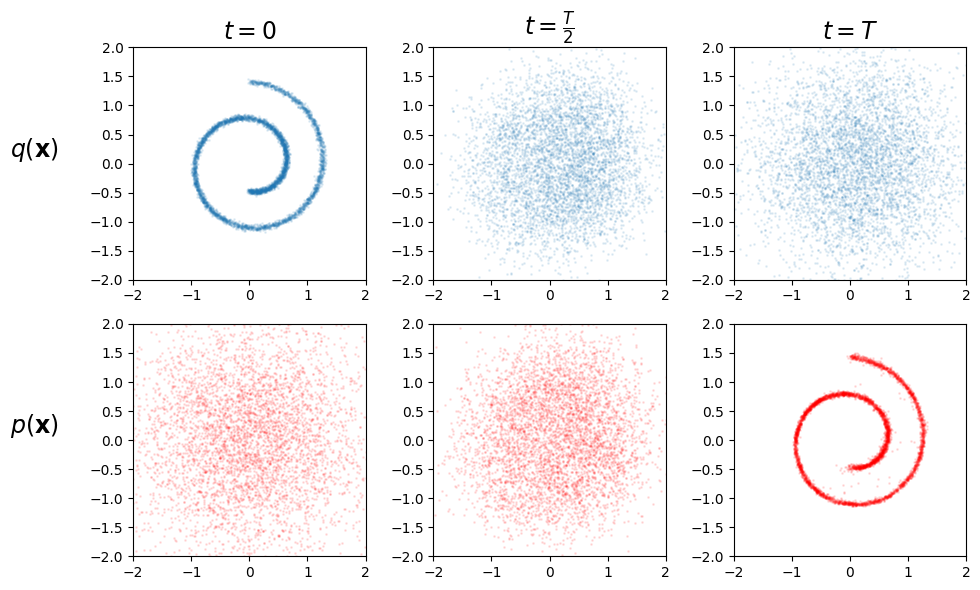

# 瑞士卷扩散模型 (Swiss Roll Diffusion Model)
这是一个基于DDPM (Denoising Diffusion Probabilistic Models) 的简单扩散模型实现，用于在二维瑞士卷数据集上完成数据生成任务，通过前向加噪和反向去噪过程学习数据分布并生成符合该分布的样本。

## 项目说明
本项目实现了基础的扩散模型，核心功能包括：
- 生成带噪声的瑞士卷数据集
- 构建MLP网络预测扩散过程中的噪声
- 实现扩散模型的前向加噪和反向去噪流程
- 训练模型并可视化扩散过程和生成结果

## 环境配置
在项目根目录执行以下命令安装依赖：
```bash
uv pip install -r Diffusion/Diffusion_Swiss_Roll/requirements.txt
```
具体依赖：
```
torch
numpy
tqdm
matplotlib
scikit-learn
```

## 运行说明
### 1. 直接运行
在项目根目录执行以下命令即可启动训练：
```bash
python Diffusion/Diffusion_Swiss_Roll/diffusion_swiss_roll.py
```

### 2. 关键参数说明
代码中可自定义的核心参数（位于主程序入口处）：
| 参数名 | 默认值 | 说明 |
|--------|--------|------|
| N_STEPS | 80 | 扩散总步数（步数越多，采样结果越精细） |
| HIDDEN_DIM | 256 | MLP网络隐藏层维度 |
| NB_EPOCHS | 10001 | 训练总轮数 |
| BATCH_SIZE | 1024 | 训练批大小（根据显存调整） |
| LR | 1e-3 | 优化器学习率 |
| BEGIN_BETA/END_BETA | 1e-4/0.02 | 线性调度扩散率Beta的起始/结束值 |
| OUTPUT_DIR | 自定义路径 | 可视化结果保存目录 |
| SAVE_FREQ | 1000 | 训练过程中图片保存频率（每N轮保存一次） |

## 运行效果
### 1. 训练过程
- 训练过程中会实时显示Loss值，每100轮更新一次进度条
- 每 `SAVE_FREQ` 轮会自动保存可视化图片到指定目录

### 2. 可视化结果
生成的图片包含6个子图，分为上下两部分：
- 上半部分：展示前向扩散过程（t=0 → t=T/2 → t=T）的瑞士卷数据加噪效果
- 下半部分：展示反向生成过程（初始噪声 → 中间步骤 → 最终生成）的样本去噪效果

可视化效果：


